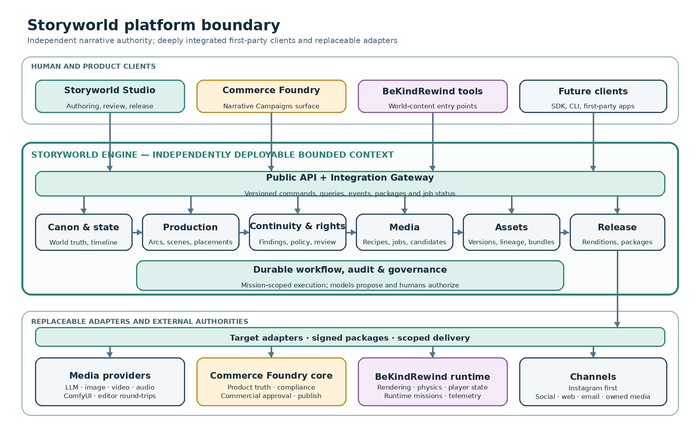

# Architecture or Outcome Model

> Summary and routing layer. The detailed canonical architecture is owned by
> the Storyworld content pack: part
> [03](storyworld/03_domain_architecture_and_media_pipeline.md) (domain model,
> implementation shape, stack, generation/continuity/revision architecture)
> and part [04](storyworld/04_foundry_rewind_channels_and_contracts.md)
> (integration boundaries, channels, APIs, events, packages). This file does
> not duplicate their mutable content.

## Context

One repository will hold an independently deployable modular monolith plus
asynchronous workers (part 03 section 9.1): `studio-web` (Next.js),
`engine-api`, `workflow-worker` (Temporal), optional `render-runner`,
`admin-tools`, and shared packages (`domain`, `application`, `contracts`,
`persistence`, `canon-continuity`, `media`, `rights-policy`,
`review-release`, `integrations`, `sdk-typescript`, `ui-system`). Commerce
Foundry remains in its own repository; exchange uses versioned packages and
generated client types.

## Actors and boundaries

The authority matrix (part 01 section 4.2) is the canonical boundary
statement. In brief: Storyworld Engine owns narrative canon, continuity,
master narrative assets, and creative approvals; Storyworld Studio holds no
independent authority; Commerce Foundry owns product truth and commercial
release; the BeKindRewind runtime owns execution and player state; InvokeAI,
ComfyUI, Octon, Harmony, and channel connectors execute scoped work without
approval or publication authority. Every project and delivery declares an
explicit `authority_host`.

## Key structural commitments

- Bounded contexts and aggregates per part 03 section 8.2; no giant
  `Storyworld` aggregate; UUIDv7/ULID identifiers, optimistic concurrency,
  immutable accepted versions, explicit supersession.
- PostgreSQL authoritative; pgvector and caches are rebuildable projections
  (proposed ADR-004).
- Temporal for durable workflows; transactional outbox/inbox and signed
  webhooks for events; no distributed transactions across products.
- Provider-neutral generation recipes are canonical; provider prompts are
  derivatives (proposed ADR-015).
- Service extraction only on measured evidence (part 03 section 9.5; proposed
  ADR-016).

## Failure behavior

Generated output enters staging as a candidate; failed, canceled, or retried
work must not corrupt accepted state; async delivery is at-least-once with
idempotent consumers; the runtime must remain operable without a live
Storyworld connection (parts 03 section 10, 04 section 12.4).

## Open design decisions

Unresolved choices are tracked in `../registers/README.md` and
`../machine-readable/raidq.json` (for example ASM-0001 stack confirmation,
DEP-0002 Octon availability), not silently defaulted here.
