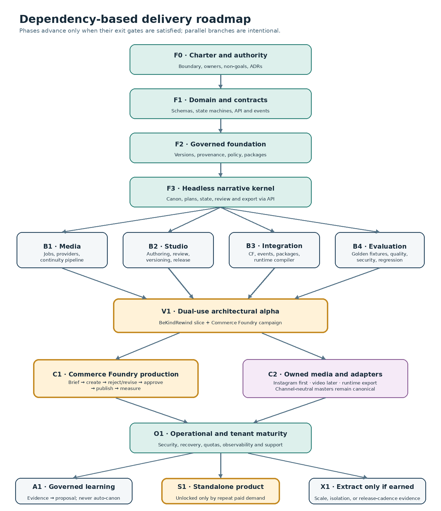

# 18. Smallest useful MVP

## 18.1 MVP objective

Prove that pinned canon, continuity-aware production, focused revision, governed approval, and portable delivery create materially more value than a collection of prompts and folders.

## 18.2 Include

- Single-organization deployment with workspace roles.
- Property, source inbox, accepted canon release, character, location, object, style, and rights records.
- Flexible production → episode → scene → panel hierarchy.
- Scene state packet and reference pack.
- One text provider and one still-image provider or local ComfyUI workflow.
- Durable generation queue with cost ceiling, provenance, candidates, and retry.
- Manual asset import and InvokeAI-style checkout/import contract.
- Candidate grid, focused panel revision, exact-version acceptance, and immutable history.
- Deterministic continuity checks plus a limited narrative and visual review.
- Simple Review Room.
- Instagram carousel rendition and manual export.
- `NarrativeCampaignBrief` fixture import and `NarrativeAssetBundle` export.
- Basic BeKindRewind world/mission manifest export.
- Package verification, audit, telemetry, and golden fixtures.

## 18.3 Postpone

- General public sign-up, billing, agency portals, and enterprise deployment.
- Broad video and audio generation.
- Direct Instagram or other social publication.
- Multiple live media providers and automatic quality-based routing.
- Fine-grained branching, real-time collaborative editing, and complex merge.
- Advanced personalization and automatic experimentation.
- Full game-editor functionality, runtime rendering, player state, and multiplayer.
- Every proposed channel adapter.
- Microservices, Kafka/NATS, and a separate vector database.

## 18.4 MVP proof scenarios

1. **Serialized still-media property:** produce three connected episodes with a recurring character, setting, visual style, object state, and focused panel regeneration.
2. **Commerce campaign:** import a pinned product brief, create a three-episode product story, submit a bundle, receive one typed rejection, revise the exact item, and pass commercial fixture validation.
3. **BeKindRewind slice:** define several locations, recurring NPCs, objects, one mission chain, and promotional media; compile and validate a runtime manifest.

The MVP passes only if the same core supports all three without a commerce-only or game-runtime fork.

## 18.5 Cheapest pre-build validation

Before substantial media automation:

1. Use Storyworld schemas and a concierge workflow to manually run two internal properties and one real or simulated Commerce Foundry campaign.
2. Build clickable Studio workflow prototypes for the World Bible, Arc Board, Scene Builder, Generation Workbench, Review Room, and CF submission.
3. Test with five to ten visually led DTC brands or boutique agencies using their approved products and existing generation/editing tools behind the scenes.
4. Charge for the outcome, not access to unfinished software.
5. Measure brief-to-approval time, revision count, continuity defects, asset reuse, repeat intent, and willingness to pay.
6. Interview independent serialized creators and interactive developers to verify that canon and continuity—not generic generation—are the differentiating reason.

If customers only value image generation or scheduling, use existing tools and narrow Storyworld to an internal capability.

# 19. Dependency-based phased roadmap

This is not a calendar. A phase begins only when its entry dependencies are satisfied and completes only when its evidence gate passes. Parallel branches reduce elapsed effort without weakening authority boundaries.

*Figure 2. Foundation phases are sequential. Media, Studio, integration, and evaluation then advance in parallel and converge at a dual-use proof. Commercialization and service extraction are conditional outcomes, not scheduled assumptions.*

## 19.1 F0 — Product charter and authority

**Depends on:** nothing.

**Purpose:** eliminate ambiguous ownership before building data or workflows.

**Deliverables:**

- Canonical product definition, use cases, vocabulary, and explicit non-goals.
- System context and authority matrix.
- Property classifications and project authority-host rule.
- Privacy, source-sensitivity, rights, and risk classifications.
- Approval taxonomy.
- Architecture decision records covering deployment boundary, identity, assets, approvals, publication, runtime state, analytics, and portability.
- Named golden fixtures and validation metrics.

**Exit gate:**

- Every important entity and decision has exactly one authoritative owner.
- Creative approval cannot be interpreted as commercial publication approval.
- Commerce Foundry, Storyworld, BeKindRewind, Octon, media tools, and connectors have unambiguous responsibilities.
- The first vertical slices and stop conditions are accepted.

## 19.2 F1 — Domain model and contracts

**Depends on:** F0.

**Purpose:** prove the model before binding it to UI or providers.

**Deliverables:**

- Versioned schemas for workspace, property, source material, canon branch/release, entity, relationship, timeline, state, style, voice, production, narrative unit, scene, beat, reveal, mission, product snapshot, placement, media recipe, asset, rendition, review, rights evidence, package, observation, and proposal.
- Lifecycle state machines and command invariants.
- OpenAPI application contract.
- Event and package catalogs.
- Commerce Foundry and runtime adapter interfaces.
- Contract fixtures for Stillhouse, editorial carousel, BeKindRewind, and a product campaign.

**Exit gate:**

- All representative fixtures can be modeled without mandatory commerce fields in generic canon or runtime execution fields in Storyworld.
- Contracts round-trip deterministically and pass compatibility tests.
- Narrative hierarchy is flexible without becoming untyped.
- Revision time and fictional story time are explicit.

## 19.3 F2 — Governed foundation

**Depends on:** F1.

**Purpose:** establish trustworthy custody before generation.

**Deliverables:**

- Repository, CI, local deployment, environments, feature flags, and migration framework.
- PostgreSQL persistence with tenant isolation.
- Immutable revisions, content-addressed object storage, asset lineage, and provenance.
- Rights, consent, sensitivity, and policy hooks.
- Identity, workspace roles, service principals, and capability boundaries.
- Audit receipts, correlation/causation IDs, transactional outbox/inbox, and idempotency.
- Deterministic signed project package export/import.
- Baseline telemetry, backup, and restore.

**Exit gate:**

- Exporting, deleting a local copy, and re-importing an accepted fixture preserves identifiers, hashes, lineage, rights, and approvals.
- Failed jobs cannot partially mutate canon.
- Command and event replay creates no duplicates.
- Every accepted asset traces to source material and transformations.
- A restore drill succeeds.

## 19.4 F3 — Headless narrative kernel

**Depends on:** F2.

**Purpose:** make the core useful through API and CLI before the full Studio.

**Deliverables:**

- Source ingestion and source-to-canon proposal workflow.
- Canon releases, entities, relationships, timeline, state, style, and reference packs.
- Production, narrative units, scenes, beats, reveals, missions, and placements.
- Scene state-packet compilation.
- Manual asset import, review, acceptance, supersession, and release-package export.
- Canon change impact report.
- Initial policy and approval commands.

**Exit gate:**

- A user can manually author and approve a complete three-episode project through public contracts without direct database edits.
- Imported or generated proposals never silently change accepted canon.
- A canon change identifies affected productions and keeps existing work pinned.
- The CLI and API can complete a portable project round trip.

## 19.5 B1 — Media orchestration and continuity pipeline

**Depends on:** F3.

**Can run in parallel with:** B2, B3, and the continuing B4 harness.

**Deliverables:**

- Temporal generation workflows with cancellation, retry, budget, priority, and resume.
- Replaceable text and still-image adapters first; interfaces for video and audio.
- Prompt/specification compiler using pinned canon and scene state.
- Reference packs, provider attachments, staging/quarantine, hashing, normalization, and lineage.
- Deterministic, narrative, visual, product-fidelity, rights, and format evaluation framework.
- Focused regeneration and external-editor round trip.
- Provider cost, latency, quality, fallback, and failure telemetry.

**Exit gate:**

- One provider can be replaced without changing canonical data.
- Failed, canceled, or retried work cannot corrupt accepted state.
- Every candidate records complete inputs, references, provider, model, workflow, parameters, cost, and derivation.
- Locked continuity attributes reach every recipe.
- A human can revise one panel without regenerating the episode.

## 19.6 B2 — Storyworld Studio workbench

**Depends on:** F3.

**Can run in parallel with:** B1, B3, and B4.

**Deliverables, in dependency order:**

1. Authentication, Command Center, property creation, and source inbox.
2. World Bible, entity libraries, timeline, style, voice, rights, and canon releases.
3. Arc Board, scene/beat builder, state inspector, and storyboard.
4. Generation queue, candidate compare, annotation, focused revision, and cost preview.
5. Continuity Console, Review Room, exact-version acceptance, and version diffs.
6. Release Builder, packages, integrations, and status.
7. Later within maturity: collaboration, analytics, administration, billing, and guided onboarding.

**Exit gate:**

- Every normal F3 and B1 task can be completed without CLI or database access.
- Users can always distinguish accepted canon, drafts, candidates, masters, renditions, and published/runtime instances.
- Revision reason and reviewer are preserved.
- Destructive changes are versioned or reversible.
- Core workflows pass accessibility and representative usability tests.

## 19.7 B3 — Integration substrate and portable packages

**Depends on:** F3.

**Can run in parallel with:** B1, B2, and B4.

**Deliverables:**

- Commerce Foundry connector SDK.
- Versioned `NarrativeCampaignBrief` and `NarrativeAssetBundle`.
- Signed approval and package receipts.
- Webhooks/events with outbox/inbox delivery and reconciliation.
- Connected and portable package import/export.
- Source-drift detection.
- SSO and service-identity interface.
- Runtime compiler interface.
- Instagram rendition/export interface.
- Integration health and replay tools.

**Exit gate:**

- Connected and portable exchange produce equivalent semantics.
- No connector accesses another product’s database.
- Duplicate delivery is harmless.
- Receiving systems treat imported packages as unapproved until they act.
- A rejected exact version can be revised and returned with lineage intact.
- Storyworld and Commerce Foundry CI run the same contract fixtures.

## 19.8 B4 — Evaluation and regression harness

**Depends on:** F1 and evolves throughout all later phases.

**Deliverables:**

- Golden fixtures and deterministic package snapshots.
- Domain, state-machine, contract, migration, permissions, and security suites.
- Provider adapter and workflow fixtures.
- Human evaluation rubrics and blinded comparison process.
- Cost, latency, failure, quality, and workflow-productivity baselines.
- Continuity defect injection for character, object, chronology, reveal, product, rights, and approval failures.

**Exit gate before V1:**

- Lineage and authority invariants are automated.
- The harness detects intentional continuity, claim, rights, source-drift, and permission defects.
- Baselines exist for time, cost, revisions, acceptance, and human quality.
- Restore, replay, duplicate delivery, and provider outage behavior are tested.

## 19.9 V1 — Dual-use architectural alpha

**Depends on:** B1, B2, B3, and B4.

**Purpose:** prove that the proposed boundary is real rather than aspirational.

**Vertical slice A — BeKindRewind:**

- Several connected locations.
- Recurring characters/NPCs and reference packs.
- Objects and collectibles.
- One mission chain with dependencies and state effects.
- Runtime manifest and promotional-media derivative.

**Vertical slice B — Commerce Foundry:**

- Pinned product and claim fixture.
- Three-episode product story.
- Placement contracts and naturalness review.
- Exact-version asset bundle and commercial validation.

**Exit gate:**

- Both are authored in the same Studio and use the same canon, asset, generation, review, provenance, and package infrastructure.
- Neither requires a fork of the core model.
- Commerce concepts remain optional extensions.
- Game and player state remain outside Storyworld.
- A second editorial or fictional property imports without schema changes.
- Operators complete both workflows through Studio.

**Stop or branch:**

- If the shared model becomes a lowest-common-denominator abstraction, stop generalizing; preserve narrower products and share only proven low-level packages.
- If value is mostly generic image/caption generation, stop the distinct Storyworld product and use existing tools.
- If commerce is the only successful use, keep the API boundary but package Storyworld as a Commerce Foundry-adjacent internal capability.
- If commerce and non-commerce slices work, continue to C1 and C2.

## 19.10 C1 — Production-grade Commerce Foundry integration

**Depends on:** V1 and stable corresponding Commerce Foundry contracts.

**Deliverables:**

- Native Commerce Foundry Narrative Campaigns surface.
- Shared SSO, contextual links, status, notifications, and focused review component.
- Production campaign briefs, asset bundles, typed findings, receipts, and drift handling.
- Exact-version commercial approval and publication authority.
- Reconciliation and audit view across both systems.
- Normalized commerce observations and correlation to placements and narrative units.

**Exit gate:**

The full rejection/revision flow in Section 11.7 succeeds with real campaign data and:

- No invented or mutated product facts.
- No stale snapshot ambiguity.
- No Storyworld bypass of Commerce Foundry authority.
- Idempotent replay.
- Complete evidence reconstruction.
- Measurable reduction in production coordination and approval churn.

## 19.11 C2 — Owned media, runtime, and channel expansion

**Depends on:** V1; may run in parallel with C1.

**Unlock adapters in evidence-based order:**

1. Instagram carousel export.
2. Instagram Story and Reel production plans.
3. Short-form video only after still continuity, cost, and revision gates pass.
4. Web and email packages.
5. TikTok, Pinterest, YouTube Shorts, and Facebook as customer evidence warrants.
6. BeKindRewind runtime exporter and derivative promotional workflow.
7. Optional direct publication adapters for non-Commerce Foundry projects.

**Exit gate:**

- One accepted episode produces at least three renditions without duplicating canon or source assets.
- Platform-rule changes do not require narrative-domain migrations.
- BeKindRewind consumes structured content without treating Storyworld as its runtime.
- Video is promoted only if quality, continuity, unit cost, and revision burden meet a written gate.
- Portable export remains functional.

## 19.12 O1 — Operational, security, and tenant maturity

**Depends on:** V1 for full proof; foundational work begins in F2.

**Deliverables:**

- OIDC/SSO, mature roles, tenant isolation, service identities, secret management.
- Budgets, quotas, rate limits, abuse controls, and entitlements.
- Complete telemetry, workflow dashboards, cost allocation, and audit export.
- Backup, restore, rollback, deletion, retention, transfer, and incident procedures.
- Threat model, security review, vulnerability management, and provider review.
- Local and hosted deployment profiles.
- Support/admin console and product operations.
- Billing hooks without forcing public billing before demand.

**Exit gate:**

- Tenant-isolation and escalation tests pass.
- Restore and rollback are demonstrated.
- Provider-outage drills preserve job and decision state.
- Users can export and delete their complete project.
- Cost ceilings work.
- Operations can trace and recover a failed asset.
- A defined pilot SLO is met under controlled use.

## 19.13 A1 — Performance-informed iteration

**Depends on:** C1 or C2, O1, sufficient consented observations, and demonstrated user need.

**Deliverables:**

- Normalized story, channel, commerce, and production observations.
- Narrative-level attribution.
- Hypothesis, experiment, allocation, variant, and result records.
- Explainable, constrained iteration proposals.
- Canon protection, privacy controls, and opt-out.

**Exit gate:**

- Recommendations never change accepted canon or publish automatically.
- Editorial and fiction teams can disable commercial optimization.
- Uncertainty and data sufficiency are visible.
- Every recommendation traces to observations and constraints.
- Controlled pilots show benefit without unacceptable voice, continuity, privacy, or cost degradation.

## 19.14 S1 — Standalone commercial Studio

**Depends on:** O1 plus actual market evidence.

**Add only after the commercial gate:**

- Self-service organization, property, and team onboarding.
- Guided world/brand bible setup and reusable templates.
- Hosted billing, entitlements, metering, and overages.
- Agency client workspaces and guest approvals.
- Documentation, developer portal, API keys, integration gallery, and support operations.
- BYO-provider or local-generation gateway where supportable.
- Product analytics and acquisition instrumentation.

**Commercial entry gate:**

Most should be true:

- At least 20 external teams complete real productions.
- At least 10 repeatedly pay.
- At least half create a second production within roughly one operating cycle after the first.
- At least 40% of qualified usage originates outside Commerce Foundry.
- Two non-commerce segments use the same Engine without major custom forks.
- Buyers will pay above generic social-generation pricing.
- Generation-adjusted margin and support burden are viable.
- A repeatable acquisition path exists.

If the gate fails, keep Storyworld as a Stavium internal platform and Commerce Foundry integration. Architectural independence remains useful even without a separate SaaS business.

## 19.15 X1 — Conditional extraction

**Depends on:** measured operational evidence; it is not a committed feature phase.

Likely future extraction candidates are:

- Media-generation workers.
- Media transformation and rendition.
- Channel publishing connectors.
- Analytics ingestion.

Canon and continuity should remain together until a compelling domain or team boundary appears.

# 20. Critical vertical slices and dependency matrix

| Slice | Dependencies | Proof required |
|---|---|---|
| VS0 — Portable project round trip | F0–F3 | Create, accept, export, remove local copy, re-import, and reproduce versions, hashes, lineage, rights, and receipts |
| VS1 — Serialized still-media property | B1, B2, B4 | Three episodes with recurring identity/style/object continuity and focused panel regeneration |
| VS2 — Commerce campaign | B1–B4, C1 | Full brief-to-publication flow including rejection, focused revision, source drift, and observations |
| VS3 — BeKindRewind runtime slice | B1–B4, C2 | Locations, characters, objects, mission dependencies, runtime package, and promotional derivatives |
| VS4 — Cross-channel derivation | C2 | Carousel, Story/Reel plan, and web/email package from one accepted episode and one lineage tree |
| VS5 — Governed learning loop | A1 | Scoped observations become a reviewable variation proposal without changing canon |
| VS6 — Paying external team | O1, S1 | A new team onboards, pays, produces, approves, exports, returns, and can export/delete its data |

## 20.1 Workstream dependencies for a small AI-assisted team

| Workstream | Starts after | Primary responsibility |
|---|---|---|
| Product and authority | Immediately | Decisions, vocabulary, boundaries, acceptance, and stop conditions |
| Domain and contracts | F0 | Schemas, state machines, API/events, packages, compatibility |
| Storage and governance | F1 | Revisions, assets, provenance, rights, policy, receipts, portability |
| Narrative intelligence | F2 | Planning, state, continuity, context compilation, validation |
| Media execution | F3 | Providers, Temporal, ComfyUI, render runner, transformation, cost and failure |
| Studio UX | F3 | Authoring, review, versioning, continuity, release, accessibility |
| Integrations | F2 | Commerce Foundry, packages, events, BeKindRewind, channel adapters |
| Evaluation | F1 | Golden corpus, automated tests, human rubrics, provider regressions |
| Operations and security | F2 | Identity, isolation, telemetry, recovery, secrets, deployment |
| Commercial validation | V1 | Concierge pilots, pricing, repeat use, acquisition and support evidence |

One person must remain accountable for domain contracts and authority boundaries. AI agents can accelerate adapters, tests, migrations, documentation, evaluation preparation, and UI implementation. Humans approve canon semantics, rights policy, security, and release gates.

## 20.2 Definition of ready

A phase or epic is ready only when:

- Its predecessor gates have passed.
- The owning bounded context and authority are known.
- Contracts and error behavior are drafted.
- Sensitive data and rights implications are classified.
- Success evidence and rollback are defined.
- A representative fixture exists.
- The work does not create a second source of truth.

## 20.3 Definition of done

An epic is done only when:

- Domain invariants and migrations are tested.
- API, events, and packages are versioned and documented.
- Authorization and audit are enforced.
- Failure, retry, cancellation, and rollback behavior are verified.
- Accessibility and observability are present.
- User-facing states distinguish proposal, accepted work, approval, and release.
- A golden fixture exercises the capability.
- Documentation and operational ownership are complete.
